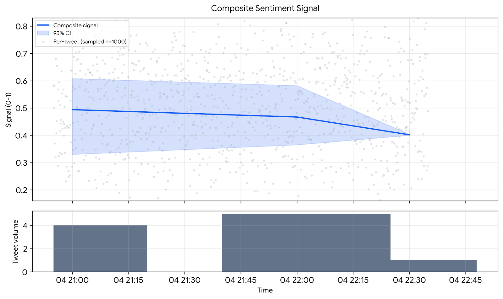

# 📈 Market Intelligence Pipeline

A production-oriented Python pipeline for collecting, processing, and analyzing real-time Indian stock market discussions from X (formerly Twitter).

---

## 📑 Table of Contents

- [Overview](#-overview)
- [Features](#-features)
- [System Architecture](#-system-architecture)
- [Project Structure](#-project-structure)
- [Installation](#-installation)
- [Configuration](#%EF%B8%8F-configuration)
- [Usage](#%EF%B8%8F-running)
- [Technical Approach](#-technical-approach)
- [Sample Outputs](#-sample-outputs)
- [Performance Optimizations](#-performance-optimizations)
- [Assignment Requirements Coverage](#-assignment-requirements-coverage)
- [Future Improvements](#-future-improvements)
- [Technologies Used](#%EF%B8%8F-technologies-used)
- [License](#-license)

---

## 📖 Overview

The **Market Intelligence Pipeline** is an end-to-end Python application that collects real-time stock market discussions from X (formerly Twitter), processes the collected data, and generates quantitative trading signals using Natural Language Processing (NLP).

The pipeline was developed as part of a technical assessment and demonstrates a modular, scalable architecture consisting of three independent stages:

1. **Data Collection**
2. **Data Processing**
3. **Data Analysis**

Unlike API-based approaches, the scraper uses **Selenium** with **Undetected ChromeDriver** for browser automation and **BeautifulSoup** for high-performance HTML parsing, enabling authenticated scraping without relying on the Twitter API.

---

## ✨ Features

- Selenium-based authenticated scraping
- BeautifulSoup HTML parsing
- Infinite scrolling
- Automatic extraction of:
  - Username
  - Timestamp
  - Tweet content
  - Engagement metrics
  - Mentions
  - Hashtags
  - Tweet URL
  - Tweet ID
- Unicode normalization
- Exact and near-duplicate detection
- Apache Parquet storage
- TF-IDF feature extraction
- Sentiment analysis
- Composite trading signal generation
- Confidence interval estimation
- Visualization
- Parallel processing

---

## 🏗️ System Architecture

```
                 X (Twitter)
                      │
                      ▼
         Selenium Authentication
                      │
                      ▼
      Search & Infinite Scrolling
                      │
                      ▼
      BeautifulSoup HTML Parsing
                      │
                      ▼
          Raw Tweets (JSON)
                      │
                      ▼
        Cleaning & Processing
                      │
                      ▼
      Exact + Near Deduplication
                      │
                      ▼
       Apache Parquet Storage
                      │
                      ▼
    TF-IDF + Sentiment Analysis
                      │
                      ▼
     Composite Trading Signals
                      │
                      ▼
      CSV Reports & Visualizations
```

---

## 📂 Project Structure

```
market_intelligence/
│
├── main.py
│
├── scraper/
│   ├── scraper.py
│   ├── parser.py
│   └── utils.py
│
├── processing/
│   ├── cleaner.py
│   ├── dedup.py
│   ├── storage.py
│   └── pipeline.py
│
├── analysis/
│   ├── sentiment.py
│   ├── tfidf_features.py
│   ├── signal.py
│   ├── plots.py
│   └── pipeline.py
│
├── data/
│   ├── raw/
│   └── processed/
│
├── requirements.txt
└── README.md
```

---

## 🚀 Installation

1. **Clone the repository**

   ```bash
   git clone https://github.com/<your-username>/market_intelligence.git
   cd market_intelligence
   ```

2. **Create a virtual environment**

   ```bash
   python -m venv venv
   ```

3. **Activate the environment**

   Windows:
   ```bash
   venv\Scripts\activate
   ```

   Linux / macOS:
   ```bash
   source venv/bin/activate
   ```

4. **Install dependencies**

   ```bash
   pip install -r requirements.txt
   ```

5. **Download the VADER lexicon**

   ```bash
   python -c "import nltk; nltk.download('vader_lexicon')"
   ```

---

## ⚙️ Configuration

The scraper authenticates using your X account credentials.

Set environment variables:

```
X_USERNAME=<your_username>
X_PASSWORD=<your_password>
```

Or enter them interactively when prompted.

---

## ▶️ Running

```bash
python main.py
```

The pipeline executes automatically:

```
Login → Scrape Tweets → Save JSON → Cleaning → Deduplication →
Parquet Storage → Sentiment Analysis → TF-IDF → Trading Signals → Visualization
```

---

## 🧠 Technical Approach

### Data Collection
- Selenium performs authentication and browser automation.
- BeautifulSoup parses rendered HTML.
- Infinite scrolling retrieves the desired number of tweets.
- Extracted fields include username, timestamp, content, engagement metrics, hashtags, mentions, tweet URL, and tweet ID.

### Data Processing
- Unicode normalization (NFKC)
- HTML decoding
- Whitespace normalization
- Timestamp normalization
- Hashtag, mention, and cashtag extraction
- Exact duplicate detection using Tweet ID and SHA-256 content hashes
- Near-duplicate detection using MinHash and Locality Sensitive Hashing (LSH)

### Storage
Processed records are stored in Apache Parquet for efficient analytics.

### Analysis
- TF-IDF vectorization
- VADER sentiment scoring
- Composite trading signal generation
- Aggregation over configurable time windows
- Confidence interval estimation using bootstrap resampling

---

## 📊 Sample Outputs

| Output | Path |
|---|---|
| Raw tweet data | `data/raw/tweets.json` |
| Processed dataset | `data/processed/tweets.parquet` |
| Aggregated signal | `data/processed/signal_timeseries.csv` |
| Visualization | `data/processed/signal_plot.png` |

### Example Screenshots

Create an `assets/` folder in the repository and place screenshots there:

```
Output/
│
├── scraper_output.png
├── parquet_preview.png
├── signal_plot.png
└── pipeline_logs.png
```

Embed them in the README like this:

```markdown
## Scraper Output


## Processed Dataset


## Trading Signal


## Pipeline Execution

```

Reviewers appreciate seeing the outputs without having to run the project.

---

## ⚡ Performance Optimizations

- Selenium is used only for authentication, navigation, and scrolling.
- BeautifulSoup performs all HTML parsing in memory.
- Parsing is limited to the tweet timeline rather than the full page.
- Duplicate tweets are skipped using a `tweet_id` cache.
- Sparse TF-IDF matrices reduce memory usage.
- Cleaning and MinHash computation run in parallel.
- Apache Parquet provides compressed, columnar storage.

---

## ✅ Assignment Requirements Coverage

| Requirement | Status |
|---|---|
| Selenium-based scraping | ✅ |
| No Twitter API | ✅ |
| Username extraction | ✅ |
| Timestamp extraction | ✅ |
| Tweet content extraction | ✅ |
| Engagement metrics | ✅ |
| Hashtags & mentions | ✅ |
| 2,000 tweet support | ✅ |
| Parallel processing | ✅ |
| Unicode handling | ✅ |
| Data cleaning | ✅ |
| Exact & near deduplication | ✅ |
| Parquet storage | ✅ |
| TF-IDF | ✅ |
| Sentiment analysis | ✅ |
| Composite trading signal | ✅ |
| Visualization | ✅ |

---

## 📌 Future Improvements

- Distributed scraping
- Proxy rotation
- CAPTCHA handling
- Incremental Parquet datasets
- Transformer-based embeddings
- Streaming ingestion
- Interactive dashboard
- Cloud deployment

---

## 🛠️ Technologies Used

- Python 3.12
- Selenium
- Undetected ChromeDriver
- BeautifulSoup
- Pandas
- NumPy
- PyArrow
- Scikit-learn
- NLTK (VADER)
- DataSketch
- Matplotlib

---

## 📄 License

This project was developed for a software engineering technical assessment and is intended for educational and evaluation purposes.
